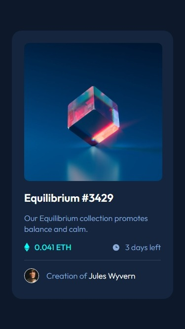
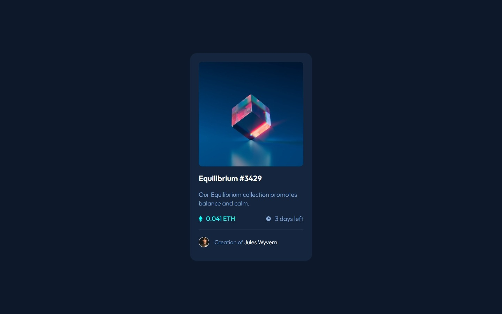

# Frontend Mentor - NFT preview card component solution

This is a solution to the [NFT preview card component challenge on Frontend Mentor](https://www.frontendmentor.io/challenges/nft-preview-card-component-SbdUL_w0U). Frontend Mentor challenges help you improve your coding skills by building realistic projects.

## Table of contents

- [Overview](#overview)
  - [The challenge](#the-challenge)
  - [Screenshot](#screenshot)
  - [Links](#links)
- [My process](#my-process)
  - [Built with](#built-with)
  - [What I learned](#what-i-learned)
  - [Continued development](#continued-development)
  - [Useful resources](#useful-resources)
- [Author](#author)
- [Acknowledgments](#acknowledgments)

## Overview

### The challenge

Users should be able to:

- View the optimal layout depending on their device's screen size
- See hover states for interactive elements

### Screenshot




### Links

- Solution URL: [Solution on GitHub](https://github.com/horoserp/nft-preview-card)
- Live Site URL: [Live Site](https://horoserp.github.io/nft-preview-card)

## My process

### Built with

- Semantic HTML
- CSS (Flexbox)

### What I learned

- This challenge made me think about how to use CSS to display the active state for the image. Once I conceptualized what was happening behind the scenes, adding another div with an active class was straightforward enough.

```html
<div class="active">
  
  
</div>
```

```css
.active,
.active > img {
  width: 300px;
  height: 300px;
  border-radius: 10px;
}

.active {
  border-radius: 11px;
  position: relative;
}

.active > img:nth-child(2) {
  width: 50px;
  height: 50px;
  position: absolute;
  left: 125px;
  top: 125px;
  display: none;
}
```

### Continued development

I hope to build off of this success and continue exploring new ways to use CSS.

### Useful resources

- [W3Schools](https://www.w3schools.com/) - This is a great reference site which helped me remember some of the required syntax.
- [Stack Overflow](https://stackoverflow.com/) - This is an excellent resource for finding answers to precise questions.

## Author

- Website - [Robert P. Horosewski](https://horoserp.github.io/React-Portfolio)
- Frontend Mentor - [@horoserp](https://www.frontendmentor.io/profile/horoserp)
- LinkedIn - [Robert P. Horosewski](https://www.linkedin.com/in/robert-horosewski-8a0608196/)

## Acknowledgments

Thanks to my wife for the encouragement to pursue my dream.
